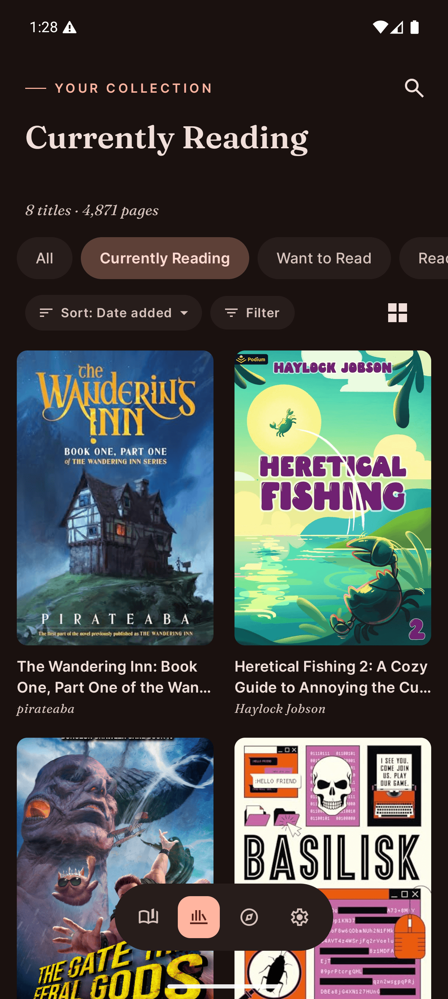
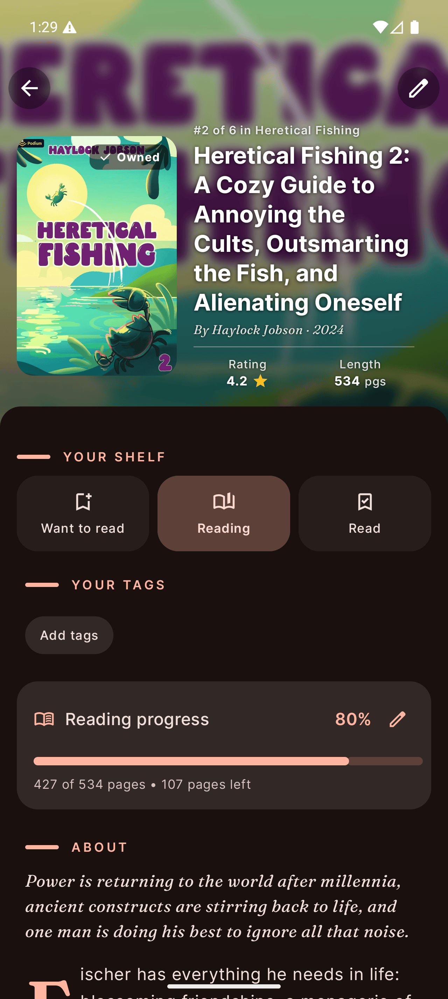
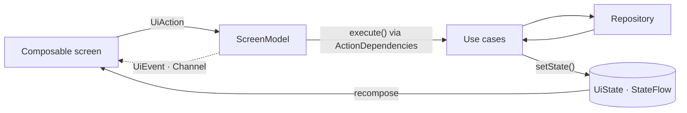

# Softcover

A [Hardcover.app](https://hardcover.app/) client for **Android, iOS, and desktop** — track what you read, what you've read, and what's next.

A Kotlin Multiplatform app: domain, data, and UI are shared across all three platforms via Compose Multiplatform. Android targets 8.0+.

> **Why Softcover?** A fast, native home for your Hardcover shelves on the devices you actually read on — your library, reading progress, deadlines, and barcode-scan-to-add in your pocket *and* on your desktop, all from a single shared codebase.

[](https://github.com/CinqueIzumi/Softcover/actions/workflows/ci.yml)
[](https://codecov.io/gh/CinqueIzumi/Softcover)
[](https://kotlinlang.org/)
[](https://www.jetbrains.com/compose-multiplatform/)
[](#running-the-apps)
[](https://developer.android.com/about/versions/oreo)
[](https://github.com/CinqueIzumi/Softcover/commits)
[](https://github.com/CinqueIzumi/Softcover)
[](LICENSE)

---

## Table of Contents

- [Screenshots](#screenshots)
- [Features](#features)
- [Tech Stack](#tech-stack)
- [Architecture](#architecture)
- [Getting Started](#getting-started)
- [Running the apps](#running-the-apps)
- [Roadmap](#roadmap)
- [Project Documentation](#project-documentation)
- [Star History](#star-history)
- [Disclaimer](#disclaimer)

---

## Screenshots

| Library | Book Details | Explore |
|:---:|:---:|:---:|
|  |  |  |

<sub>The same shared UI runs on Android, iOS, and desktop from one codebase. More shots live in [`screenshots/`](screenshots/).</sub>

---

## Features

### Library
- Browse books organized by status — **Want to Read**, **Currently Reading**, **Read**, **Did Not Finish**, **Owned**.
- Add and remove books from your library.
- Mark editions as owned.

### Reading
- See currently reading books and audiobooks at a glance.
- Track progress by page number or percentage for book editions.
- Track listening progress in `HH:MM:SS` or percentage for audiobook editions.
- Mark books as read in one tap.
- Start a distraction-free **focus mode** reading session that times your reading, with pause/resume/stop controls and inline page-progress editing.
- Resume an ongoing session from anywhere via a persistent session bar, backed by a foreground service.

### Explore
- Browse trending books on Hardcover.
- Pick up where you left off with a **Continue Series** shelf for series you're partway through.
- Search the Hardcover catalogue by title and add or remove books directly from results.
- Scan a book's barcode to look it up by ISBN and add it to your library, with manual ISBN entry and a fallback flow for unknown ISBNs.
- Review and manage your search history.

### Book Details
- View title, author, description, ratings, release date, and page count or audiobook duration.
- Change reading status — Want to Read, Currently Reading, Read, Did Not Finish.
- Update reading or listening progress.
- Set a reading deadline with a required pages-per-day or minutes-per-day pace.
- Switch between book and audiobook editions.

### Lists
- Create custom lists to organize your books, with duplicate-name detection.

### Profile
- View your profile and reading statistics.
- Log out.

### Settings
- Toggle between a floating and docked bottom navigation bar.
- Choose your preferred date format.
- Receive in-app update prompts when a newer version is available on Google Play.

### Onboarding
- Connect your Hardcover account on first launch by entering your API token, after a short introductory walkthrough.

---

## Tech Stack

#### Core
| Technology | Version | Purpose |
|---|---|---|
| [Kotlin Multiplatform](https://kotlinlang.org/docs/multiplatform.html) | 2.3.21 | Primary language, shared across Android/iOS/desktop |
| [Compose Multiplatform](https://www.jetbrains.com/compose-multiplatform/) | 1.11.0 | Declarative UI shared across all platforms (resolves to Jetpack Compose on Android) |
| [Material 3 (expressive)](https://m3.material.io/) | 1.11.0-alpha07 | Design system and theming (CMP expressive APIs) |
| [Android Gradle Plugin](https://developer.android.com/build) | 9.0.0 | Android build tooling |
| [Gradle (KTS)](https://gradle.org/) | 9.1.0 | Build system with version catalog |
| [KSP](https://github.com/google/ksp) | 2.3.9 | Kotlin Symbol Processing for Room (per-target) |

#### Data & Networking
| Technology | Version | Purpose |
|---|---|---|
| [Apollo](https://www.apollographql.com/docs/kotlin) | 5.0.0 | Multiplatform GraphQL API client |
| [Room](https://developer.android.com/jetpack/androidx/releases/room) | 2.7.2 | Local database for caching books (KMP, bundled SQLite driver) |
| [DataStore](https://developer.android.com/jetpack/androidx/releases/datastore) | 1.2.0 | Key-value storage for settings and search history (okio-backed) |
| [okio](https://square.github.io/okio/) | 3.9.1 | Multiplatform file I/O |
| [kotlinx-serialization](https://github.com/Kotlin/kotlinx.serialization) | 1.9.0 | JSON serialization |
| [kotlinx-datetime](https://github.com/Kotlin/kotlinx-datetime) | 0.7.1 | Multiplatform date/time |

#### App Architecture
| Technology | Version | Purpose |
|---|---|---|
| [Voyager](https://voyager.adriel.cafe/) | 1.1.0-beta02 | Screen navigation and state holder models |
| [Koin](https://insert-koin.io/docs/setup/koin/) | 3.5.3 | Dependency injection |
| [Coroutines](https://github.com/Kotlin/kotlinx.coroutines) | 1.10.2 | Asynchronous and reactive flows |
| [Coil](https://github.com/coil-kt/coil) | 3.2.0 | Multiplatform image loading (OkHttp fetcher on Android/desktop, Ktor on iOS) |
| [Reorderable](https://github.com/Calvin-LL/Reorderable) | 2.4.3 | Drag-and-drop list reordering |
| [Kermit](https://kermit.touchlab.co/) | 2.0.6 | Multiplatform logging (via the `AppLog` facade) |

#### Per-platform
| Technology | Version | Platform | Purpose |
|---|---|---|---|
| [CameraX](https://developer.android.com/training/camerax) + [ML Kit](https://developers.google.com/ml-kit/vision/barcode-scanning) | 1.4.2 / 17.3.0 | Android | Camera preview + on-device ISBN barcode decoding |
| [Play In-App Updates](https://developer.android.com/guide/playcore/in-app-updates) | 2.1.0 | Android | In-app update prompts |
| [WorkManager](https://developer.android.com/jetpack/androidx/releases/work) | 2.10.1 | Android | Background work scheduling |
| [Ktor](https://ktor.io/) | 3.1.0 | iOS | Coil's network engine (Darwin) |
| [KSafe](https://github.com/ioannisa/KSafe) | 2.1.2 | Desktop | API-key storage in the OS secret store |
| [Compose Desktop](https://www.jetbrains.com/compose-multiplatform/) | 1.11.0 | Desktop | Window + native distribution packaging |

#### Testing
| Technology | Version | Purpose |
|---|---|---|
| [JUnit 5](https://junit.org/junit5/) | 5.11.4 | Unit test runner (Jupiter API, engine, params) |
| [MockK](https://mockk.io/) | 1.13.17 | Mocking library for Kotlin |
| [Kotest](https://kotest.io/) | 5.9.1 | Fluent assertions (`shouldBe`, etc.) |
| [kotlinx-coroutines-test](https://github.com/Kotlin/kotlinx.coroutines/tree/master/kotlinx-coroutines-test) | 1.10.2 | Coroutine test utilities (`runTest`) |
| [Turbine](https://github.com/cashapp/turbine) | 1.2.0 | Testing library for Kotlin `Flow` |

#### Platforms
- **Android:** min SDK 26 (Android 8.0), target SDK 37, Java 11
- **iOS:** `iosArm64` + `iosSimulatorArm64` (shared `OrchestrationKit` framework, Xcode shell in `iosApp/`)
- **Desktop (JVM):** Compose Desktop application (`:desktopApp`), JDK 17

---

## Architecture

Softcover follows **Clean Architecture** as a multi-module Gradle build with a strict tier DAG: `:app` (platform shell) → `:orchestration` (nav host + cross-feature use cases) → `:feature:*` → `:core:*`. A feature module never depends on a sibling feature; the boundary is enforced at build time by a custom `checkModuleGraph` gate. The full layering and the TOAD state-management framework are documented in [ARCHITECTURE.md](ARCHITECTURE.md) and [MODULE_STRUCTURE_GUIDELINES.md](MODULE_STRUCTURE_GUIDELINES.md).

### Module graph

```mermaid
%%{
  init: {
    'theme': 'neutral'
  }
}%%

graph LR
  subgraph :core
    :core:domain["domain"]
    :core:book["book"]
    :core:lists["lists"]
    :core:deadlines["deadlines"]
    :core:library["library"]
    :core:preferences["preferences"]
    :core:designsystem["designsystem"]
    :core:database["database"]
    :core:network["network"]
    :core:profile["profile"]
    :core:identity["identity"]
    :core:personal["personal"]
    :core:notification["notification"]
    :core:connectivity["connectivity"]
  end
  subgraph :feature
    :feature:library["library"]
    :feature:app_update["app_update"]
    :feature:settings["settings"]
    :feature:book_detail["book_detail"]
    :feature:explore["explore"]
    :feature:lists["lists"]
    :feature:onboarding["onboarding"]
    :feature:profile["profile"]
    :feature:reading["reading"]
    :feature:scan["scan"]
    :feature:session["session"]
  end
  :feature:library --> :core:domain
  :feature:library --> :core:book
  :feature:library --> :core:lists
  :feature:library --> :core:deadlines
  :feature:library --> :core:library
  :feature:library --> :core:preferences
  :feature:library --> :core:designsystem
  :core:database --> :core:domain
  :core:preferences --> :core:domain
  :core:preferences --> :core:network
  :feature:app_update --> :core:domain
  :core:designsystem --> :core:domain
  :core:designsystem --> :core:book
  :core:designsystem --> :core:library
  :core:designsystem --> :core:profile
  :core:designsystem --> :core:identity
  :core:designsystem --> :core:personal
  :core:designsystem --> :core:preferences
  :core:deadlines --> :core:domain
  :core:deadlines --> :core:database
  :feature:settings --> :core:domain
  :feature:settings --> :core:preferences
  :feature:settings --> :core:lists
  :feature:settings --> :core:library
  :feature:settings --> :core:designsystem
  :app --> :orchestration
  :app --> :core:designsystem
  :app --> :core:domain
  :app --> :core:notification
  :core:network --> :core:domain
  :orchestration --> :core:domain
  :orchestration --> :core:network
  :orchestration --> :core:database
  :orchestration --> :core:preferences
  :orchestration --> :core:identity
  :orchestration --> :core:book
  :orchestration --> :core:lists
  :orchestration --> :core:deadlines
  :orchestration --> :core:personal
  :orchestration --> :core:profile
  :orchestration --> :core:library
  :orchestration --> :core:connectivity
  :orchestration --> :core:notification
  :orchestration --> :core:designsystem
  :orchestration --> :feature:book_detail
  :orchestration --> :feature:explore
  :orchestration --> :feature:library
  :orchestration --> :feature:lists
  :orchestration --> :feature:onboarding
  :orchestration --> :feature:profile
  :orchestration --> :feature:reading
  :orchestration --> :feature:scan
  :orchestration --> :feature:session
  :orchestration --> :feature:settings
  :orchestration --> :feature:app_update
  :core:personal --> :core:domain
  :core:personal --> :core:database
  :feature:reading --> :core:domain
  :feature:reading --> :core:book
  :feature:reading --> :core:deadlines
  :feature:reading --> :core:library
  :feature:reading --> :core:preferences
  :feature:reading --> :core:profile
  :feature:reading --> :core:notification
  :feature:reading --> :core:designsystem
  :feature:book_detail --> :core:domain
  :feature:book_detail --> :core:identity
  :feature:book_detail --> :core:designsystem
  :feature:book_detail --> :core:book
  :feature:book_detail --> :core:lists
  :feature:book_detail --> :core:deadlines
  :feature:book_detail --> :core:profile
  :feature:book_detail --> :core:preferences
  :feature:book_detail --> :core:database
  :feature:book_detail --> :core:network
  :feature:explore --> :core:domain
  :feature:explore --> :core:book
  :feature:explore --> :core:identity
  :feature:explore --> :core:database
  :feature:explore --> :core:network
  :feature:explore --> :core:designsystem
  :feature:profile --> :core:domain
  :feature:profile --> :core:profile
  :feature:profile --> :core:designsystem
  : --> :app
  : --> :core
  : --> :desktopApp
  : --> :feature
  : --> :orchestration
  : --> :core:book
  : --> :core:connectivity
  : --> :core:database
  : --> :core:deadlines
  : --> :core:designsystem
  : --> :core:domain
  : --> :core:identity
  : --> :core:library
  : --> :core:lists
  : --> :core:network
  : --> :core:notification
  : --> :core:personal
  : --> :core:preferences
  : --> :core:profile
  : --> :feature:app_update
  : --> :feature:book_detail
  : --> :feature:explore
  : --> :feature:library
  : --> :feature:lists
  : --> :feature:onboarding
  : --> :feature:profile
  : --> :feature:reading
  : --> :feature:scan
  : --> :feature:session
  : --> :feature:settings
  :core:library --> :core:domain
  :core:library --> :core:book
  :core:library --> :core:lists
  :core:library --> :core:preferences
  :core:library --> :core:identity
  :feature:lists --> :core:domain
  :feature:lists --> :core:lists
  :feature:lists --> :core:designsystem
  :feature:scan --> :core:domain
  :feature:scan --> :core:book
  :feature:scan --> :core:designsystem
  :desktopApp --> :orchestration
  :desktopApp --> :core:domain
  :core:book --> :core:domain
  :core:book --> :core:network
  :core:book --> :core:database
  :core:lists --> :core:domain
  :core:lists --> :core:database
  :core:lists --> :core:network
  :core:lists --> :core:book
  :feature:onboarding --> :core:domain
  :feature:onboarding --> :core:identity
  :feature:onboarding --> :core:designsystem
  :core:profile --> :core:domain
  :core:profile --> :core:identity
  :core:profile --> :core:network
  :core:connectivity --> :core:domain
  :core:connectivity --> :core:database
  :core:connectivity --> :core:book
  :core:connectivity --> :core:lists
  :feature:session --> :core:designsystem
  :feature:session --> :core:notification
  :core:identity --> :core:preferences
  :core:identity --> :core:domain
  :core:notification --> :core:domain

classDef kotlin-multiplatform fill:#C792EA,stroke:#fff,stroke-width:2px,color:#fff;
classDef android-application fill:#2C4162,stroke:#fff,stroke-width:2px,color:#fff;
classDef unknown fill:#676767,stroke:#fff,stroke-width:2px,color:#fff;
classDef kotlin-jvm fill:#8150FF,stroke:#fff,stroke-width:2px,color:#fff;
class :feature:library kotlin-multiplatform
class :core:domain kotlin-multiplatform
class :core:book kotlin-multiplatform
class :core:lists kotlin-multiplatform
class :core:deadlines kotlin-multiplatform
class :core:library kotlin-multiplatform
class :core:preferences kotlin-multiplatform
class :core:designsystem kotlin-multiplatform
class :core:database kotlin-multiplatform
class :core:network kotlin-multiplatform
class :feature:app_update kotlin-multiplatform
class :core:profile kotlin-multiplatform
class :core:identity kotlin-multiplatform
class :core:personal kotlin-multiplatform
class :feature:settings kotlin-multiplatform
class :app android-application
class :orchestration kotlin-multiplatform
class :core:notification kotlin-multiplatform
class :core:connectivity kotlin-multiplatform
class :feature:book_detail kotlin-multiplatform
class :feature:explore kotlin-multiplatform
class :feature:lists kotlin-multiplatform
class :feature:onboarding kotlin-multiplatform
class :feature:profile kotlin-multiplatform
class :feature:reading kotlin-multiplatform
class :feature:scan kotlin-multiplatform
class :feature:session kotlin-multiplatform
class : unknown
class :core unknown
class :desktopApp kotlin-jvm
class :feature unknown

```


### State flow (TOAD)

Every screen is driven by a custom framework on top of Voyager's `ScreenModel`. Interactions flow one way: a `UiAction` runs against use cases (resolved via `ActionDependencies`), the result is written with `setState()`, and the immutable `UiState` re-emits on a `StateFlow` to recompose the UI. One-time effects (navigation, snackbars) go out as `UiEvent`s on a `Channel`.



---

## Getting Started

### Prerequisites
- Android Studio (latest stable) — for Android
- JDK 17 — for the desktop target and the build toolchain
- Xcode (latest stable) — for iOS (macOS only)
- A Hardcover.app account and API token

### Build & Run
```bash
./gradlew assembleDebug          # Build a debug APK
./gradlew assembleRelease        # Build a release APK
./gradlew test                   # Run unit tests
./gradlew :app:test              # Run unit tests for the app module
./gradlew connectedAndroidTest   # Run instrumented tests (device/emulator required)
./gradlew lint                   # Run Android Lint
```

---

## Running the apps

Softcover shares a single Kotlin Multiplatform codebase across **Android**, **iOS**, and **desktop (JVM)**. The shared backend (domain, data, and Compose UI) lives in `:core:*` / `:feature:*` / `:orchestration`; each platform has a thin entry point — `:app` (Android), `iosApp/` (iOS), and `:desktopApp` (desktop). On first launch, each platform stores your Hardcover API token in its own secure store (Android Keystore, iOS Keychain, or the desktop OS keychain).

### Android (`:app`)
The simplest path is **Android Studio**: open the project, select the `app` run configuration and a device/emulator, and Run.

From the command line (a connected device or running emulator is required):
```bash
./gradlew :app:installDebug      # build, install, then launch from the app icon
./gradlew :app:assembleDebug     # build only → app/build/outputs/apk/debug/app-debug.apk
```

### Desktop (JVM) (`:desktopApp`)
Run directly from source:
```bash
./gradlew :desktopApp:run
```
Or build a native installer for the current OS (`.dmg` on macOS, `.msi` on Windows, `.deb` on Linux):
```bash
./gradlew :desktopApp:packageDistributionForCurrentOS   # → desktopApp/build/compose/binaries/
```

### iOS (`iosApp/`)
iOS is driven by **Xcode** — Gradle only builds the shared `OrchestrationKit` framework, which the Xcode build invokes automatically:
```bash
open iosApp/iosApp.xcodeproj
```
Select a simulator or device and Run. Running on a **physical device** requires code-signing setup — see [iosApp/README.md](iosApp/README.md). If Xcode can't locate the toolchain, point it at the full Xcode install:
```bash
sudo xcode-select -s /Applications/Xcode.app/Contents/Developer
```

---

## Roadmap

Softcover is being actively redesigned. The high-level direction lives in [ROADMAP.md](ROADMAP.md), and the sequenced, pick-up-next work items live in [ROADMAP_STEPS.md](ROADMAP_STEPS.md) — completed steps are deleted as they land, so the file always reflects what's left.

---

## Project Documentation

| Document | Purpose |
|---|---|
| [ARCHITECTURE.md](ARCHITECTURE.md) | Clean Architecture layout and the TOAD state-management framework |
| [MODULE_STRUCTURE_GUIDELINES.md](MODULE_STRUCTURE_GUIDELINES.md) | Module tiers, allowed dependency directions, and where new code belongs |
| [DESIGN_SYSTEM.md](DESIGN_SYSTEM.md) | Color roles, editorial typography, layout primitives, components, and patterns |
| [CODE_STYLE_GUIDE.md](CODE_STYLE_GUIDE.md) | Naming, layout, and whitespace conventions |
| [ROADMAP.md](ROADMAP.md) | Redesign roadmap and the sequenced step list |
| [CLAUDE.md](CLAUDE.md) | Guidance for Claude Code when working in this repo |

---

## Star History

<a href="https://star-history.com/#CinqueIzumi/Softcover&Date">
  
</a>

---

## Disclaimer

This project is an independent, open-source application and is **not affiliated with, endorsed by, or sponsored by** [Hardcover.app](https://hardcover.app/).